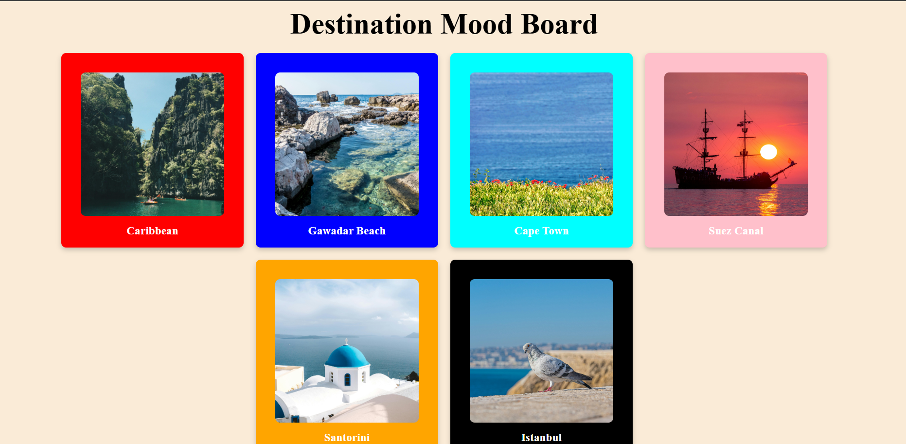
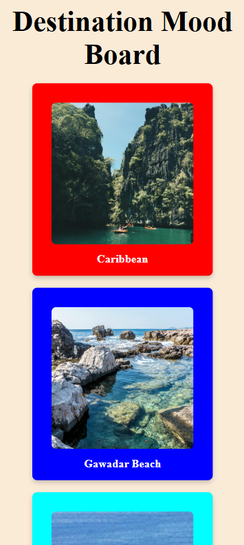

# 📌 Destination Mood Board

A simple and responsive React project where I created a “Destination Mood Board” using reusable components. Data is passed through props and rendered dynamically using the map function.

## Screenshots

## 🚀 Features

Dynamic rendering using map()
Data passed via props
Reusable components
Responsive UI design
Clean and minimal layout

## 🛠️ Tech Stack

React JS
JavaScript (ES6+)
CSS

## 💡 How It Works

I created a data file containing destination details (image + name).
Passed that data as props to a reusable card component.
Used map() to loop through the data and render UI dynamically.
Applied styling to make it responsive across devices.

## 🎯 Learning Outcome

Better understanding of props
Using map() for dynamic rendering
Component reusability
Basic responsive design
