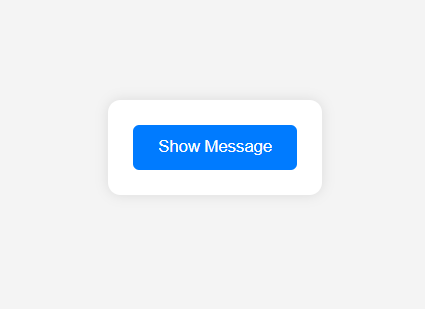
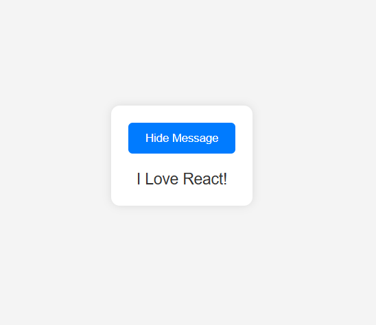

# 🔘 Toggle Text App

A simple and beginner-friendly React project that demonstrates **conditional rendering** and **state management** using a toggle button.

## 🚀 Features

- Toggle text between **Show** and **Hide**
- Button label updates dynamically
- Clean and simple UI
- Uses React `useState` hook
- Beginner-friendly logic

## 🛠️ Tech Stack

- React.js
- JavaScript (ES6)
- CSS

## Screenshots

## 📸 How It Works

- Initially, the text is hidden
- When the user clicks the button:
  - Text becomes visible
  - Button text changes to **"Hide Message"**

- Clicking again:
  - Text gets hidden
  - Button text changes back to **"Show Message"**

## 💡 Learning Outcome

This project helped me understand:

- How **state works in React**
- How to use **conditional rendering**
- Handling **button click events**
- Writing clean and reusable components

✨ This is a small project but a great step towards mastering React basics.
