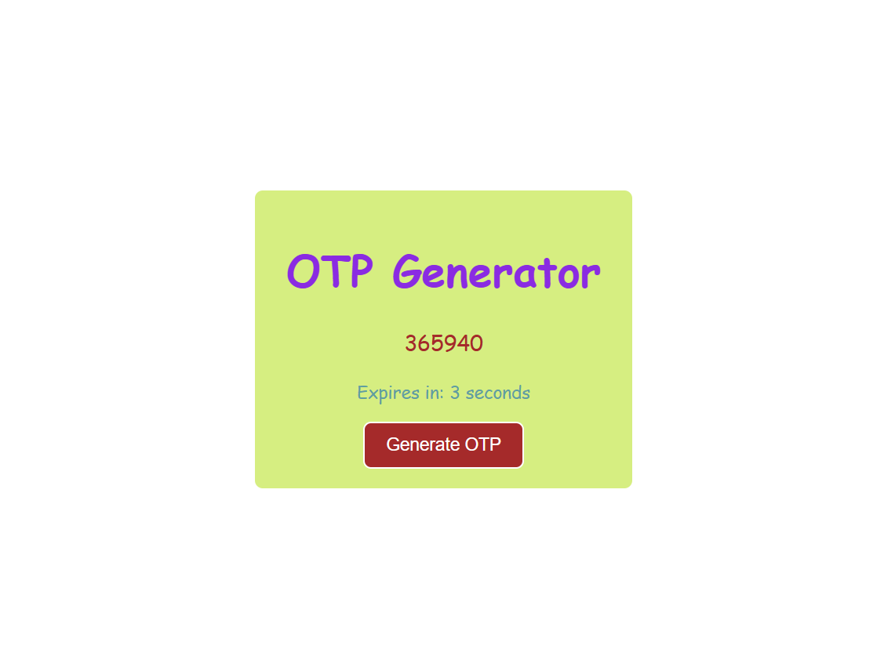
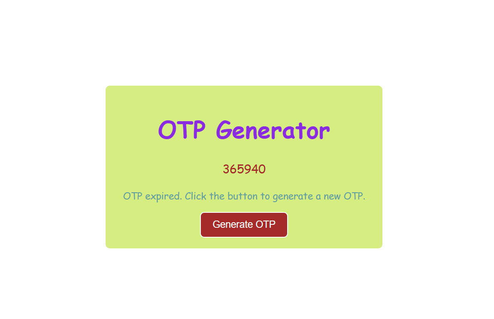

# 🔐 OTP Generator App

A simple and interactive One-Time Password (OTP) Generator built using React. This app generates a 6-digit OTP and includes a countdown timer that expires after 5 seconds.

## 🚀 Features

- 🔢 Generates a secure 6-digit OTP
- ⏳ 5-second countdown timer
- 🔄 Automatically expires OTP after timer ends
- 🚫 Button disabled during active countdown
- ♿ Accessibility support using `aria-live`
- ⚡ Built with React Hooks (`useState`, `useEffect`, `useRef`)

## 🛠️ Tech Stack

- React (Functional Components)
- JavaScript (ES6+)
- HTML5 & CSS3

## ⚙️ How It Works

- User clicks the **Generate OTP** button.
- A random 6-digit OTP is generated.
- A 5-second countdown timer starts.
- The button gets disabled while the timer is running.
- Timer updates every second.
- Once the timer reaches 0:
  - OTP expires
  - Expiry message is displayed
  - Button becomes active again

## ♿ Accessibility

- Uses `aria-live="polite"` to announce timer updates for screen reader users without interrupting them.

## 💻 Code Highlights

- OTP generation using `Math.random()`
- Countdown handled using `useEffect`
- Cleanup with `clearTimeout` to prevent memory leaks
- Controlled UI updates using state

## 📌 Future Improvements

- Add copy-to-clipboard feature
- Add OTP input verification UI
- Increase timer customization
- Add animations and better UI design
- Store OTP history

✨ Built with React and hands-on learning
