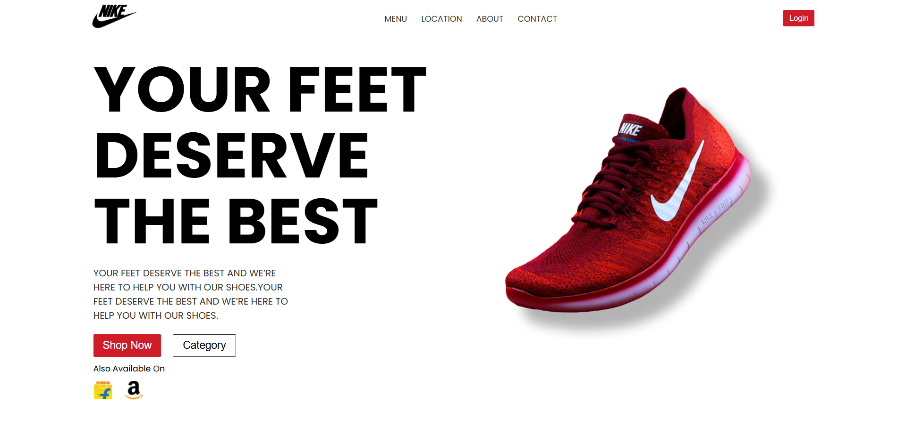
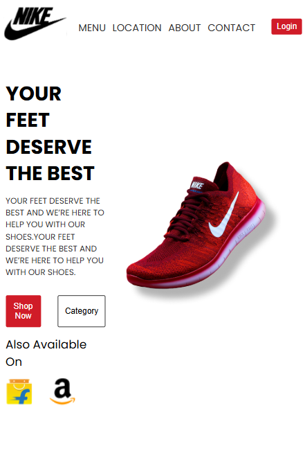

# 🏠 Landing Page (Brand UI)

This is a **responsive brand landing page** built using React and CSS.
The design is inspired by a modern product landing page (Nike-style UI).

## 🚀 Features

- Clean and modern UI
- Responsive design (mobile + desktop)
- Navigation bar with menu items
- Hero section with product image
- Call-to-action buttons (Shop Now, Category)

## 🛠️ Tech Stack

- React
- JavaScript
- CSS

## 🎯 Learning Outcome

- Learned how to convert Figma design into React UI
- Practiced layout using Flexbox
- Improved component structure and reusability

## 📸 Preview

## ⭐ Author

Nishu Singh
