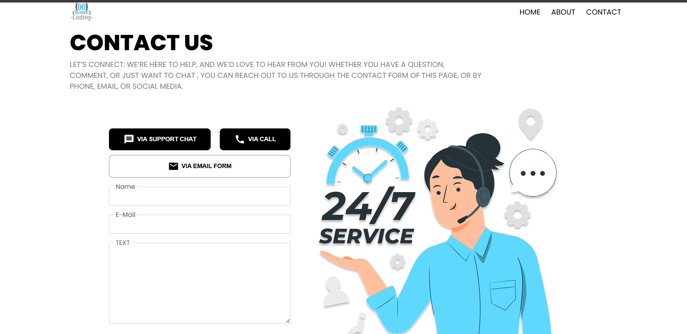

# 📞 Contact Us UI

This project is a responsive **Contact Us page UI** built using React.  
It demonstrates component reusability, props handling, conditional rendering, and scoped styling using CSS Modules.

## 🚀 Features

- Clean and modern UI design
- Reusable Button Component
- Props used to pass dynamic data
- Conditional rendering for different button styles
- CSS Modules for scoped styling
- Contact form with input fields
- Simple and responsive layout

## 🧠 What I Learned

- Creating reusable components in React
- Using props for dynamic UI
- Conditional rendering based on props
- Using CSS Modules to avoid style conflicts
- Writing modular and maintainable code

## 🎨 Styling Approach

- Used **CSS Modules** for each component
- Avoided global CSS conflicts
- Improved code maintainability and scalability

## 🛠️ Tech Stack

- React.js
- CSS Modules

## Screenshot

## ⭐ Author

Nishu Singh
